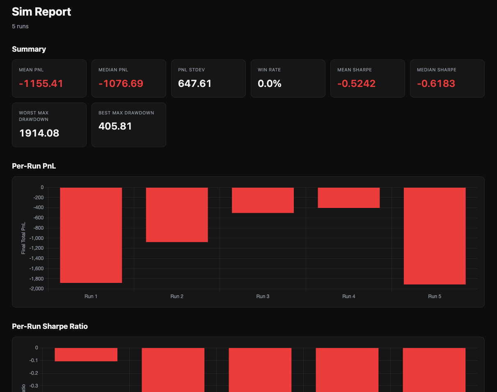
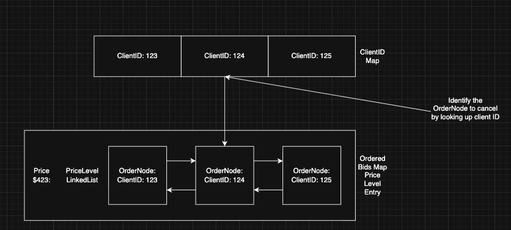
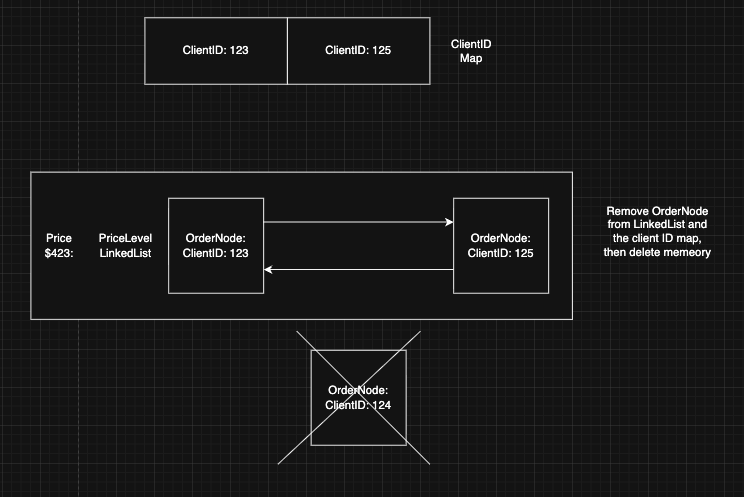
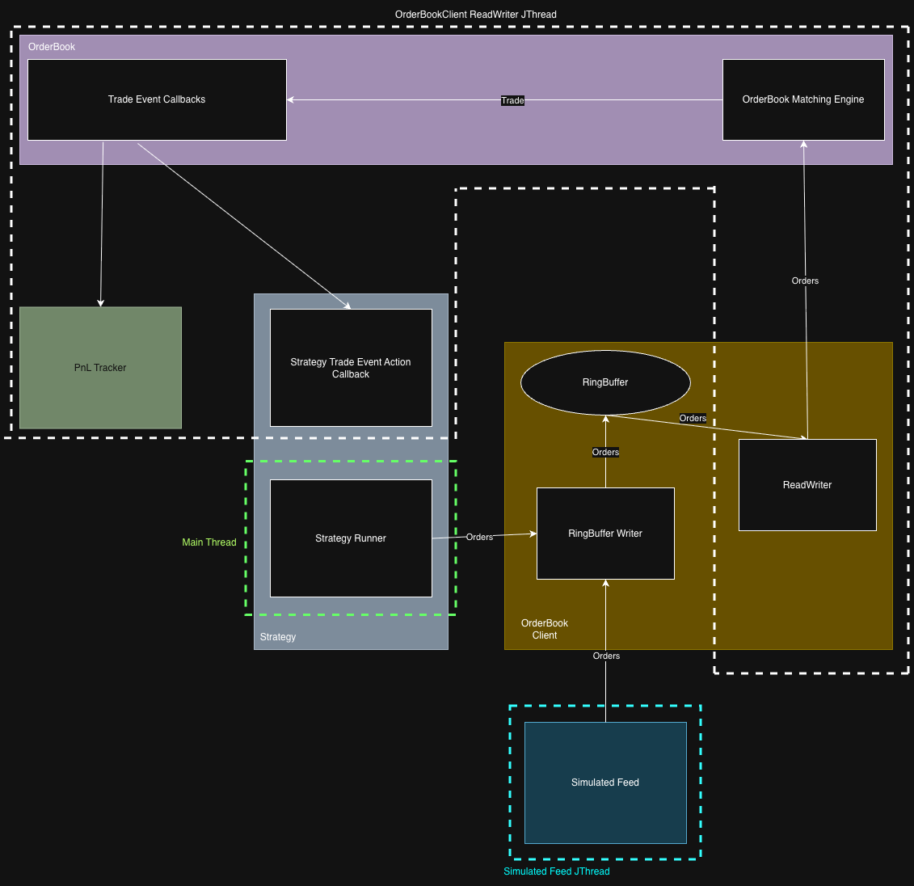

# Apex

Apex is a multi-threaded limit order book and market-making simulation engine. It allows users to test out different trade strategies against a simulated orderbook via a monte carlo simulation. Apex will track important PnL metrics during 
a strategy run and store them for you to analyze post trade. 

This current iteration of Apex only has one strategy that can be ran against the monte carlo simulation,
but this will be expanded upon in the future. Soon Apex will allow you to supply your own strategies and
will allow you to connect to live exchange data, not just simulated.

# How to Run

From the project root, the following makefile target will allow you to run a given strategy against in a monte carlo simulation:

```
make <strategy_name>
```

The only strategy currently registered is a market making strategy. To run this in a monte carlo simulation, execute this command:

```
make marketmaker
```

After your simulation is finished running, the PnL metrics captured will be stored in the default location `app/sim/pnl`.
Each run will be have metrics stored under a sub directory here with a UUID. Under this run sub directory you will also find
a report.html file that allows you to visualize your PnL metrics. Here's a snapshot of an example report from an albeit un-profitable simulation run:



To configure aspects of your simulation and strategies you can edit the config file found [here](app/sim/simcfg.yaml). Details
on each configuration can be found in the following sections.

# PnL Metrics

The PnL metrics captured during simulation runs are as follows:

## Intra PnL Metric Summary

PnL metrics for individual runs of the monte carlo simulation are stored in the PnL metrics directory in the file intra_summary.csv. These metrics include:

- **Final Total PnL**: the total PnL accrued by the strategy during the simulation.
- **Final Inventory**: the inventory left over after the strategy completed.
- **Sharpe Ratio**: the ratio of the mean and standard deviations of PnL changes within a run. Used to see how well the strategy performs under market volatility. A larger value means a more consistent strategy.
- **Max Drawdown**: maximum difference between a peak in our PnL and the next trough in our PnL. E.g. a PnL sequence of 50, 20, -10, 80 would yield a max drawdown of 50 - -10 = 60.

## Inter PnL Metric Summary

PnL metrics across individual runs of monte carlo simulations are stored in the PnL metrics directory in the file inter_summary.csv. These metrics include:

- **Median PnL**: The median of total PnLs captured across each simulation run.
- **Mean PnL**: The mean of total PnLs captured across each simulation run.
- **Stdev PnL**: The standard deviation of total PnLs captured across each simulation run.
- **Win Rate**: The percentage of simulation runs that had positive total PnLs.
- **Worst max Drawdown**: The biggest max drawdown seen from all simulations that were run.
- **Best max Drawdown**: The smallest max drawdown seen from all simulations that were run.
- **Median Sharpe**: The median of all sharpe ratios captured by all the simulations that were run.
- **Mean Sharpe**: The mean of all sharpe ratios captured by all the simulations that were run.

# Strategies

This section gives a more in depth explanation on how the existing base strategies work.

## Market Maker Strategy

The market maker strategy can be configured [here](app/sim/simcfg.yaml) by altering the mm_strategy fields. 

The market maker strategy is very simple. It tracks inventory during runs and uses our current inventory to deduce where on the order book we place trades. The strategy works iteratively, where 2 trades are placed simultaneously on every iteration. One trade
is placed as a buy order on the bid side of the book and another a sell order on the ask side of the book. The spread between these orders is what we profit off of. The objective of the strategy is to not be directional - we do not want to be long or short at all times. Instead, we want to be reactionary. If one side of the trades fills, we cancel the other side and assess what price to place the next two trades with using our existing inventory and market conditions.

Inventory reflects how much of an asset the strategy currently holds. Negative inventory means the strategy is short (we have sold too much off) and positive inventory means the strategy is long (we have bought too much). 

When the strategy executes trades, it will capture what it deems to be the fair price of the order book by taking the halfway point of the best bid and ask prices. If either bid or ask is missing it will take whichever is present as the fair price. The strategy computes a reservation price by shifting the fair price. Fair price is shifted using the skew_factor and the status of the strategy's inventory with the following formula:

`reservation_price = fair_price - (inventory * skew_factor)`

The base_spread configuration is then used to determine how far from the fair_price to execute buy and sell orders, as follows:

`bid_price = reservation_price - (base_spread / 2)`

`ask_price = reservation_price + (base_spread / 2)`

The strategy will then place buy and a sell orders at these prices. Note how the reservation_price formula aids in the strategy's goal of being reactionary. If our inventory was negative it means we're too short and instead want to buy more to pocket the spread. A negative inventory therefore means we move up from the fair price with a multiple of skew_factor. A higher reservation_price means a greater likelihood of the buy side of our strategy filling and a lower chance of the sell side filling (as we buy higher but also sell higher). This will aid us in being less short and allow us to pocket some spread. The opposite holds true if we were too long.

Every time the strategy gets a fill from one of its sides, it updates its inventory, cancels the other side's order and repeats
the computation of reservation price + order placement cycle explained before. If the strategy notices that its reached the
max_inventory defined in its config it won't place an order on a given side. E.g. if the max inventory was 20 and our inventory
is now at -20, we're too short, so on the next iteration of the strategy we only place a buy order.

The strategy has its shortcomings. It currently doesn't track the prices it executes trades at, so there is a small chance that the fair price of the book can be a result of the last orders placed by the strategy on the book. This is unlikely to happen given
the simulated orderbook is quite liquid, but for an illiquid market this could present a problem.

The strategy is also susceptible to adverse selection. If an informed trader is aware of the price going up they might buy from
our sell side order. Our strategy will then be short and will move upwards with the market. That trader can now sell higher and make a profit and then repeat the process. Our sell side will be repeatedly hit and we'll go shorter and shorter with no profit.
The simulated order book is designed to simulate adverse selection too, so the strategy must be tweaked if you want to remain
profitable during simulations. E.g. widening your base spread or increasing your skew factor can guard against adverse selection
by ensuring your trades a further away from prices targeted by well informed traders. This will come at the cost of fill rate.

# Simulated Feed

Strategies are currently ran against a simulated orderbook. The simulated order book is driven by the simfeeder found [here](src/simfeeder/simfeeder.cpp). The simfeeder can be configured [here](app/sim/simcfg.yaml) by altering the dist fields.

When the simfeeder is ran it begins firing off simulated orders against our order book for strategies to react
to + work with. The simfeeder generates orders using distributions found in the configuration file mentioned earlier. We use geometric Brownian motion for fair price selection because it ensures positive prices and models proportional returns, consistent with the Avellaneda-Stoikov framework. Exponential distributions for arrival timing model a Poisson process, matching empirical observations of order flow in real markets.

In detail, each distribution in the config plays the following role:

**starting_fair_price**

starting_fair_price is the fair price the market starts at. Subsequent iterations of the sim feeder will deviate from this price via brownian motion.

**fair_price_sigma**

fair_price_sigma is used to control how volatile the markets fair price is in the simulator. The market fair price is modelled using
geometric brownian motion. A smaller sigma means the fair price is less volatile and sticks closer to the mean. A larger sigma means
that fair price is more volatile and has a greater chance of straying away from the mean. Greater sigma means greater price swings.

The fair price is established via geometric brownian motion to ensure price remains positive and increments subtly - we multiply existing fair price with
the new value from the normal distribution.

**order_price_lambda**

The price at which orders are placed is determined by taking an offset from the fair price. This offset is determined via an exponential distribution. We use an exponential distribution to ensure price offsets are always +ve and that very large values are more unlikely to be
selected. This mimics actual markets, where orders are mainly priced around the fair price. order_price_lambda controls how close to the
fair price prices remain. A larger value means price offsets are smaller and thus orders tend to cluster around the fair
price. Higher lambda values result in smaller values as the exponential decay curve decays rapidly, most values end up sitting near zero. This can be better represented by understanding that the mean of an exponential distribution is 1/lambda.

**arrive_rate_lambda**

The arrival rate of orders in the orderbook is determined via an exponential distribution. arrive_rate_lambda dictates how frequently
these orders arrive in the order book. A higher arrive_rate_lambda means orders arrive more frequently and there is less pause between
simulator iterations.

**order_qty_size_lambda**

Order quantities selected for order placement follow an exponential distribution. order_qty_size_lambda is used to determine how large these order quantities will be. A larger order_qty_size_lambda value means that order quantities selected will be smaller.

**side_prob**

side_prob is used to determine what the probability of orders being executed on a specific side are. It follows a bernoulli distribution. For example, if a value of 0.5 is given, 50% of orders will be buy and 50% will be sell.

**aggressive_prob**

aggressive_prob is used to determine the likelihood that a limit order placed by the feeder will be aggressive. It follows a bernoulli distribution. E.g. if a value of 0.1 is supplied, this means that 10% of limit orders will be aggressive, whilst 90% will be passive. An order is considered aggressive if it takes liquidity. For example an aggressive buy order is one placed above the fair price, the higher the more aggressive. This is because it is more likely to be filled as we're trying to buy at a higher price, taking liquidity in the process. A passive order would be the opposite of this, so a passive buy order is one placed below fair price, less likely to be filled and instead makes liquidity.

**market_order_prob, cancel_order_prob and limit_order_prob**

market_order_prob, cancel_order_prob and limit_order_prob are used together to determine the likelihood that orders placed are either market, cancel or limit orders respectively. They are combined together to form a discrete distribution. E.g. if market_order_prob=0.1, cancel_order_prob=0.3 and limit_order_prob=0.6, this means there is a 10% chance that orders placed will be market orders, 30% chance cancel orders and 60% chance limit orders.

# Architecture

## OrderBook

Apex includes its own electronic order book and matching engine, source code can be found [here](src/orderbook/orderbook.cpp). NOTE: the orderbook is intended to be used on a single thread and is not for multi-threaded use. The book holds resting orders at different price levels. Price levels are stored in an ordered set, keyed by price. Bids and asks get their own separate map of price levels. An ordered map was used to ensure bid prices (and their corresponding price levels) are stored in decreasing order and conversely to ensure ask prices are stored in ascending order. An ordered map also has the benefits of avoiding hash collisions.

Each price level contains a linked list of order nodes. An order node represents an order resting on the book at that price level. A linked list was the data structure chosen for this as it makes for an efficient order removal mechanism on order cancellation. When an order is cancelled, its node's address is found using the orders client ID. The order is then removed in place from the linked list by having the previous and next nodes point to each other and deleting the underlying memory for that order node.




The order book has a callback called TradeEventAction. The trade event action is invoked every time a trade occurs on the book. Clients are able to register custom trade event actions on the book for it to call on a trade, this allows the capture of useful trade information.

## Ring Buffer

## Orderbook Client

The orderbook is designed to run on a single thread and is not intended for multithreaded access. For this reason an OrderBookClient was created to be in charge of submitting messages to the orderbook serially. The source code for this client can be found [here](src/orderbookclient.cpp).

The order book client contains an internal Single Producer Single Consumer (SPSC) ring buffer that it uses to queue messages to send to the orderbook. The ring buffer has several advantages:

1. No reallocation of memory, the buffer remains in a fixed place in memory and is fixed in size.
2. No lock needed to access on hot path. This is because the buffer keeps a track of disparate read and write locations inside of its fixed size array, they never intersect during an actual operation.
3. Natural back pressure can be applied, the orderbook can read as it needs and the clients can write as they need.

Strategies and the simulated feeder must inject the same orderbook client into themselves and use this client to interact with the book. It is thread safe. The intended flow is one strategy per orderbook and simfeeder, so this means one orderbook client per strategy. Below is a simple diagram showcasing how all components fit together:



1. The orderbook client is started in a separate jthread via a run method (thread highlighted white in diagram).

2. The strategy runner is ran via the main thread. The simulated feeder is ran in its own jthread.

3. The strategy runner and sim feeder send orders to the order book clients writer. The clients ReadWriter then picks this up in the reader jthread started in Run.

4. Orders are sent to the orderbook from the client once read from the buffer. This all happens on 1 thread. 

5. Trades are fired to trade event action callbacks which are picked up by the callbacks registered in the PnL tracker and strategy.